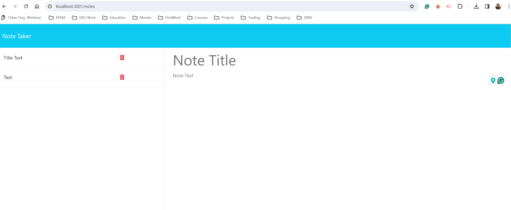

# Note Taker

## Description

I supplied back-end functionality to front-end starter code to create a note taking application that can be used to write and save notes. 

## Installation
To run application locally, clone this project repository to your computer. Use the command "npm install" to install dependecies (Express.js & UUID). Type "node server.js" or "npm start" to start server.

## Usage
* Go to http://localhost:3001/
* Click "Get Started" button to start application
* Type a new note title and note text in the designated input areas. 
* Click "Clear Note" button to clear input fields.
* Click the "Save Note" button to save a new note. 
* Access and open saved notes by selecting a note in the list located on the left side. 
* Click "New Note" button to create a new note.
* Click the red trash can to delete a saved note. 

## License

[MIT License](https://opensource.org/licenses/MIT)